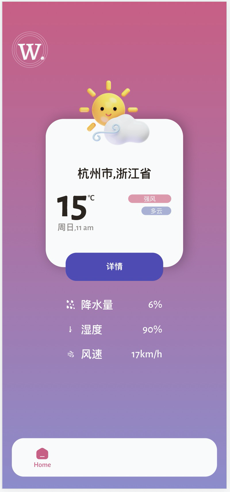
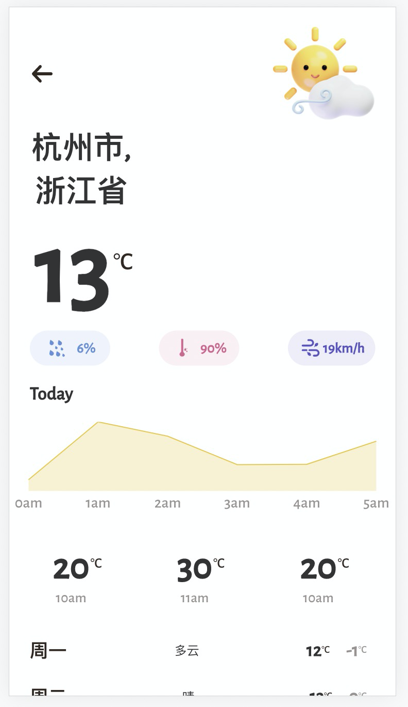

# 天气预报

本 repo 是一款简易的天气预报 web 应用，支持在移动端与 pc 端查看，功能有:

- 当时天气详情
- 未来 24 小时天气预报
- 未来一周天气预报
- 离线访问功能

应用地址: https://sun0day.github.io/assets/ ，  建议在 chrome 浏览器控制台 device 模式下浏览。

效果图如下：





## 开发

### 前置准备

要求 npm@6+, node@14+

### 安装依赖

进入项目根目录后执行 `npm install`

### 目录说明

```
./
 |- src // 源码目录
    |- assets // js 脚本所需静态资源
    |- public // html 所需静态资源
    |- pages // 页面模块
    |- utils // 工具函数
    |- App.js // 入口文件
 |- config // 打包配置
 |- scrips // 打包脚本
 |- assets // 打包输出的静态资源
 |- package.json
```

### 部署

在根目录执行 `npm run build` 后推送到 github 即可

## 遗留问题

- safari 端无法渲染部分 svg
- 描述天气温度变化的 echarts 折线图无法很好自适应所有移动端