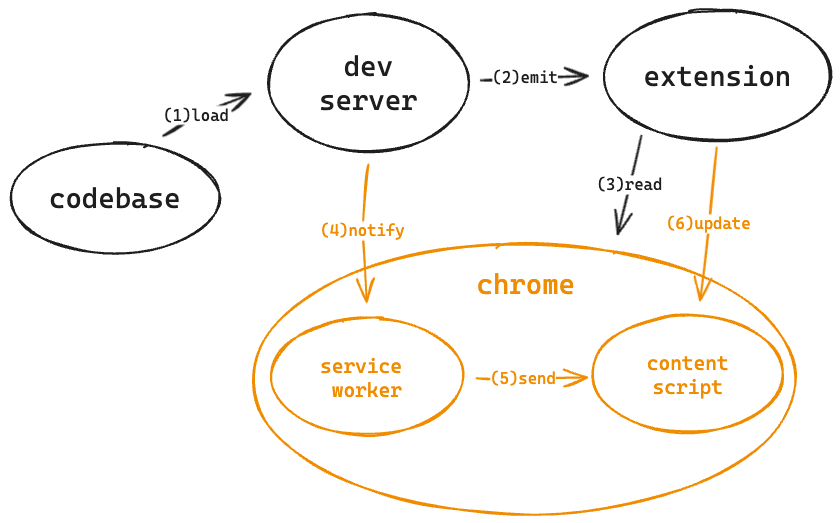
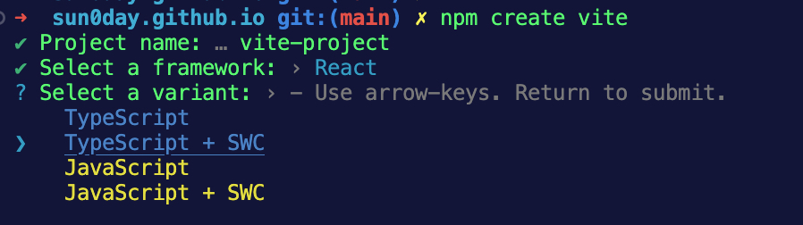

# Rethinking Chrome Extension DX

Recently I have been developing an internal Chrome extension via Vite5. In the beginning, I pursued completing this extension MVP as soon as possible, so I didn't put much focus on the extension engineering. When this extension's features became more and more complex, I found there was still much room to improve the extension DX. Unfortunately, I see few articles and projects concerning the extension DX issues. This article will discuss some critical issues of Chrome extension DX. I also started a new [GitHub repository](https://github.com/sun0day/happy-chrome-extension) to solve these issues, but it still needs a lot of work.

## Pain of HMR

Currently, you can either manually reload your latest extension as the [official document says](https://developer.chrome.com/docs/extensions/get-started/tutorial/hello-world#reload) or reload it internally in scripts via the [`chrome.runtime.reload`](https://developer.chrome.com/docs/extensions/reference/api/runtime#method-reload) native API. Frequently manually reloading, especially reloading an extension is painful during development. As to `chrome.runtime.reload` , it won't be executed until the extension scripts call it, hence, we need to tell the extension scripts to reload totally or replace the manipulated modules once there is a change on related files.

### Assets loading

Unlike loading a normal web page through the network, Chrome loads the extension assets from the local disk. Modern bundler dev servers usually handle asset transformation in memory since it is more efficient. This will block Chrome from querying assets from them. 

One solution is to emit those assets into the extension directory from the servers' memory during runtime. Some other bundlers support to do that, but they can hardly support HMR.

### WebSocket limitation

Modern bundlers usually create a WebSocket channel between the browser and the dev server to handle the HMR communication. However, WebSocket is not allowed to be used in some Chrome extension scripts like [content scripts](https://developer.chrome.com/docs/extensions/reference/manifest/content-scripts). 

On the other hand, WebSocket works in the [background service worker](https://developer.chrome.com/docs/extensions/reference/manifest/background). So we could make the bundler create the channel between the service worker and the dev server. Once there's a modification on the module, the server first notifies the service worker, and then the service worker tells content scripts to replace the old module via the [messaging APIs](https://developer.chrome.com/docs/extensions/develop/concepts/messaging). 

### Flow overview

After doing some magic, the Chrome extension HMR process would look like:



1. Dev server **loads and watches** the source code.
2. Dev server **emits** the related assets to the extension directory.
3. Chrome **reads** the whole extension directory and **builds** a WebSocket channel between dev server and service worker.
4. Dev server **emits** new module to the extension directory when it watches changes, and then **notifies** service worker.
5. Service worker **sends** messages about the new module to content script.
6. Content script **updates** the new module without reloading.


## Advanced runtime API

Chrome provides rich [native APIs](https://developer.chrome.com/docs/extensions/reference/api) for developers. Those native APIs are flexible and primitive, you can compose them for more advanced features. The issue here is that we need more straightforward APIs to simplify our codes. For example, we can run the following codes in the service worker to retrieve cookies of the matched URL.

```js
/* service worker */
const cookies = await chrome.cookies.getAll({ url })
```

If we want to retrieve cookies from the current page context, we need to get cookie stores first, otherwise, we may retrieve cookies from another Chrome window instance.

```js
/* service worker */
chrome.runtime.onMessage.addListener((request, sender, sendResponse) => {
    // get all cookie stores
    const stores = await chrome.cookies.getAllCookieStores();
    // get current page's cookie store
    const storeId = stores.find((store) => store.tabIds.includes(sender.tab.id)).id;
    const cookies = await chrome.cookies.getAll({ url: request.url, storeId })
    // send cookies back to content script
    sendResponse(cookies)
})
```

We can encapsulate the cookie retrieve logic into a single function `getCookies` so that the code could be simpler.

```js
/* service worker */
chrome.runtime.onMessage.addListener((request, sender, sendResponse) => {
    // retrieve cookies by on function
    const cookies = getCookies(request.url, sender.tab.id)
    // send cookies back to content script
    sendResponse(cookies)
})
```

Encapsulating reusable logic is not only good for making the extension's codes clean and robust but also for cutting native API understanding costs. I found there are many reusable logics based on the native APIs during my extension development. We can design better APIs for more complex scenarios.


## Storage issues

[`chrome.storage`](https://developer.chrome.com/docs/extensions/reference/api/storage) is designed for storing extension-specific data in the client browser. It's usually used to share data across extension components, tabs, windows, and even devices. Still, it has several flaws which annoy me.

### Data synchronization

It's common that synchronize data from a storage and react it to UI immediately, especially in some UI frameworks. Unlike other client storages(`localStorage`, `sessionStorage`, etc...), Chrome [`StorageArea`](https://developer.chrome.com/docs/extensions/reference/api/storage#type-StorageArea) has a different implementation(type definition, 'change' event, etc...) with [`Storage`](https://developer.mozilla.org/en-US/docs/Web/API/Storage). Hence, we need to encapsulate a `useStorage`-style hooks for `chrome.storage` in a specific UI framework. For example:

```ts
/* react hooks
 * @param key {string} stored data key
 * @param defaultValue {T} stored data default value
 * @returns {[T, (nextValue: T) => void]} returns current stored data value and its setter
 */
function useChromeStorage<T>(key: string, defaultValue: T): [T, (nextValue: T) => void]
```

A more low-level API to watch the stored data change can be:

```ts
/* react hooks
 * @param key {string} stored data key
 * @param listener {(newValue: T) => void} stored data change callback
 * @returns void
 */
function listenStorage<T>(key: string, listener: (newValue: T) => void ): void
```

This brings us back to the subject of the previous section, "We need more advanced API".

### Data validation

Writing dirty or wrong data to storage happens. Bugs caused by these data(especially stored on the client side) are usually hard to debug and fix. To prevent incorrect data from going to storage unexpectedly, it's better to validate data strongly before executing the writing operation. We can use some third-party libraries such as [joi](https://www.npmjs.com/package/joi) to do the data schema validation.

### Data debug

There is no way to see what data are stored in the `chrome.storage` through the Chrome dev tools unless you log them out to the console. The same issue happens on the exchanged messages between extension scripts. This is not friendly for us to debug codes. We can log the data or message information the same as [`redux-logger`](https://www.npmjs.com/package/redux-logger) does. Whenever there is a storage data change or message passing during dev mode, the debug APIs will log.

## Stricter lint

We can turn on the ESLint [`env.webextensions`](https://eslint.org/docs/latest/use/configure/language-options) in case ESLint unrecognized the native APIs.

```json 
{
 "env": {
    "webextensions": true
  }
}
```


Preseting native APIs in ESLint is not enough, we still need more rules to help us find some potential runtime errors. Here are some rules that would help write robust codes.

### `no-permission`

When we use a native API, we must declare its [permission](https://developer.chrome.com/docs/extensions/reference/permissions-list) in the `manifest.json` first, otherwise, an error will occur when the extension calls this API. To avoid this error during runtime, we can detect it when coding via ESLint.

### `version-mismatch`

Since manifest V3 is supported generally in Chrome 88 or later, APIs of manifest V2 will be deprecated or refactored gradually. If we use V2 APIs in the V3 context, `version-mismatch` rule will prompt an ESLint error directly.

### `no-unavailable-api`

Different contexts have different accessibilities to native APIs. For example, as the [document](https://developer.chrome.com/docs/extensions/develop/concepts/content-scripts#capabilities) says, we can only use partial native APIs in content scripts. This type of error can be confusing for extension newbie developers, they have to Google it or review the extension document to find out why the native API is `undefined`.

### `no-unhandled-message`

When the extension becomes more and more complex, we need to make sure both senders and receivers handle the messages correctly. `no-unhandled-message` rule will detect whether a message has a handler set on the receiver side in case the message is not handled properly.

By adding those and more rules, we can write robust codes more easily.

## Extension Starter

The final issue I am gonna talk about is the extension starter. A starter is a tool that can quickly initialize an extension app and manage its project development. A good starter can be flexible for different extension components, scripts, languages and UI frameworks while keeping stable for the bottom bundler, package manager and CI/CD. We can learn that from [`Vite`](https://vitejs.dev/) and integrate the powers mentioned above into it.



## Conclusion

This article talked about some issues and solutions of Chrome extension DX, due to space limitations, there are still quite a lot of issues(such as "message criteria" and "inspect mode") not mentioned here. What's weird, I saw very few articles and projects trying to solve these problems.  I hope I can find the best practices for them in the future, if you have any ideas about improving Chrome extension DX, you can leave an issue or start a discussion at the repository mentioned above.
