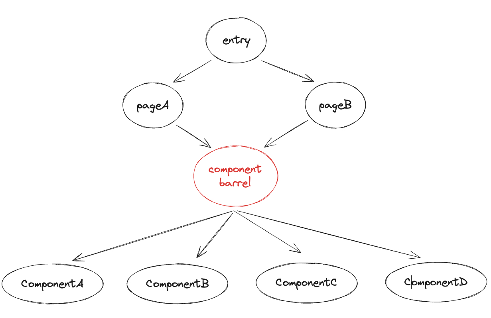

# Speed up loading barrel file in Vite

## Barrel file debacle

> A "barrel file" is file that does nothing but only re-export other files.

Bigger projects with barrel files typically produce more complex module graphs. When constructing a module graph, the bundler needs to

- load all the related files
- parse and transform those files
- do some optimization(e.g. tree-shaking) 
- etc...

This means the bundler has to spend more time constructing a complex module graph. [@marvinhagemeist](https://twitter.com/marvinhagemeist) explained in more detail how the barrel file affects bundling speed in this [article](https://marvinh.dev/blog/speeding-up-javascript-ecosystem-part-7/).

However, when it comes to Vite, barrel file slows down not only building speed but also dev page load speed. Suppose there is a module graph containing a barrel file below:



```js
// pageA.jsx
import {ComponentA, ComponentB} from './component'

// pageB.jsx 
import {ComponentC} from './component'

// component/index.jsx -> barrel file
export {default as ComponentA} from './ComponentA'
export {default as ComponentB} from './ComponentB'
export {default as ComponentC} from './ComponentC'
export {default as ComponentD} from './ComponentD'
```

Then start the Vite dev server and open `pageA` in the browser, you can find `ComponentA`, `ComponentB`, `ComponentC` and `ComponentD` are all loaded despite that `pageA` only imports `ComponentA` and `ComponentB`. So does `pageB`. What's worse, modifying irrelevant `ComponentD` will trigger HMR even page reload. It's fine for this tiny codebase, but how about hundreds even thousands of import requests. Although Vite dev server is fast enough to handle import requests, modern browsers usually have a maximum parallel HTTP connection limit which means current import requests would block the next coming requests.

## Coexist with barrel file

Although barrel file is a burden for bundlers, it's still quite neat for developers, no? Besides, getting rid of barrel files might not be an easy thing, especially in some large projects. Developers have to change all the barrel file imports to directly import target modules. It's simple but tedious. Of course, you can write some scripts to do code shift. But next time you maintain another project, you have to do it again, quite annoying, no?


## Speed up loading barrel file in Vite

### Use HTTP/2

### Redirect `import`