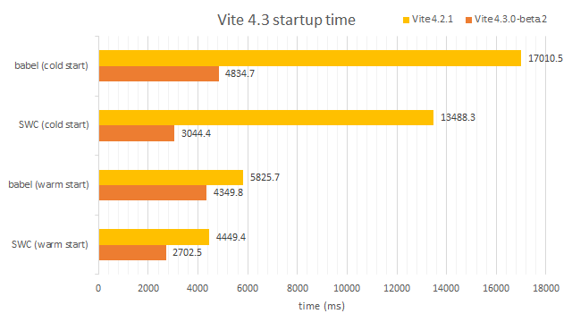
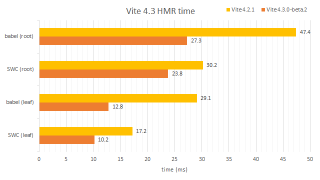

# How we made Vite 4.3 faaaaster :rocket:

Just like [@sapphi-red](https://github.com/sapphi-red/) said, Vite 4.3 has made [amazing performance improvements](https://gist.github.com/sapphi-red/25be97327ee64a3c1dce793444afdf6e) over Vite 4.2.

> These benchmarks based on a large project with 1000 react components. And these react components were transformed by [vite-plugin-react](https://github.com/vitejs/vite-plugin-react) and [vite-plugin-react-swc](https://github.com/vitejs/vite-plugin-react-swc).

As a new rookie on the team, I am so glad that I've joined this party. To let more people know what we did to make Vite 4.3 so fast, we are happy to share the experience.

## Smarter resolve strategy

Vite resolves all the received URLs and paths to get the target modules.

In Vite 4.2, there are many **redundant resolve logics and unnecessary module searches**. Vite 4.3 makes the resolve logic **simpler**, **stricter** and **more accurate** to reduce calculations and `fs` calls.

### A simpler resolve

Vite 4.2 heavily depends on the [resolve](https://www.npmjs.com/package/resolve) package to resolve the dependency's `package.json`, when we looked into the source code of [resolve](https://www.npmjs.com/package/resolve), there was much useless logic while resolving `package.json`. Vite 4.3 abandons [resolve](https://www.npmjs.com/package/resolve) and follows the simpler resolve logic: directly checks whether `package.json` exists in the nested parents' directories.

### A stricter resolve

Vite has to call the Nodejs `fs` APIs to find the module. But IO is expensive. Vite 4.3 narrows the file search and skips searching some special paths in order to reduce the `fs` calls as much as possible. e.g:

1. Since `#` symbol would not appear in URLs and users could control that no `#` symbol in the source files' paths, Vite 4.3 no longer checks paths with `#` symbol inside the user's source files but only searches them in the `node_modules`.
2. In Unix systems, Vite 4.2 checks each absolute path inside the root directory first, it's fine for most paths, but it would be very likely to fail if the absolute path starts with the root. To skip searching `/root/root/path-to-file` while `/root/root` doesn't exist, Vite 4.3 judges whether `/root/root` exists as a directory at the beginning and pre-caches the result.
3. When Vite server receives `@fs/xxx` and `@vite/xxx`, it would be unnecessary to resolve these URLs again. Vite 4.3 directly returns the previously cached result instead of re-resolving them.

### A more accurate resolve

Vite 4.2 recursively resolves the module when the file path is a directory, this would lead to unnecessary calculations repeatedly. Vite 4.3 flattens the recursive resolution and applies appropriate resolution to different types of paths. It's also easier to cache some `fs` calls after flattening.

### Package package package

Thanks to [@bluwy](https://github.com/bluwy)'s nice work, Vite 4.3 breaks the performance bottleneck of resolving `node_modules` package data.

Vite 4.2 uses absolute file paths as the package data cache keys. That's not enough since Vite has to traverse the same directory both in `pkg/foo/bar` and `pkg/foo/baz`.  Vite 4.3 uses not only the absolute paths(`/root/node_modules/pkg/foo/bar.js` & `/root/node_modules/pkg/foo/baz.js`) but also the traversed directories(`/root/node_modules/pkg/foo` & `/root/node_modules/pkg`) as the keys of `pkg` cache.

Another case is that Vite 4.2 looks up `package.json` of a deep import path inside a single function, e.g when Vite 4.2 resolves a file path like `a/b/c/d`, it first checks whether root `a/package.json` exists, if not, then finds the nearest `package.json` in the order `a/b/c/package.json` -> `a/b/package.json`, but the fact is that finding root `package.json` and nearest `package.json` should be handled separately since they are needed in different resolve contexts. Vite 4.3 splits the root `package.json` and nearest `package.json` resolution in two parts so that they won't mix.

## `fs.realpathSync` issue

There was an interesting [`realpathSync` issue](https://github.com/nodejs/node/issues/2680) in Nodejs, it pointed out that `fs.realpathSync` is 70x slower than `fs.realpathSync.native`. 

But Vite 4.2 only uses `fs.realpathSync.native` on non-Windows systems due to its [different behavior on Windows](https://github.com/nodejs/node/issues/37737). To fix that, Vite 4.3 adds a network drive validation when calling `fs.realpathSync.native` on Windows.

You can check more details [here](https://github.com/vitejs/vite/pull/12580).

> Vite never gives up on Windows :fire:

## Non-blocking tasks

As an on-demand service, Vite dev server can be started without all the stuff being ready.

### Non-blocking `tsconfig` parsing

Vite server needs `tsconfig` data when pre-bundling `ts` or `tsx`. 

Vite 4.2 waits for `tsconfig` data to be parsed in the plugin hook `configResolved` before the server starts up. Page requests could visit the server once the server starts up without `tsconfig` data ready even though the request might need to wait for the `tsconfig` parsing later.

Vite 4.3 inits `tsconfig` parsing before the server starts up, but the server won't wait for it. The parsing process runs in the background. Once a `ts`-related request comes in, it will have to wait until the `tsconfig` parsing is finished.

### Non-blocking file processing

There are plenty of `fs` calls in Vite, and some of them are synchronous. These synchronous `fs` calls may block the main thread. Vite 4.3 changes them to asynchronous. Also, it's easier to parallelize the asynchronous functions. One thing about asynchronous functions you should care about is that there might be many `Promise` objects to be released after they are resolved. Thanks to the smarter resolve strategy, the cost of releasing `fs`-`Promise` objects is much less.

## HMR debouncing

Consider two simple dependency chains `C <- B <- A` & `D <- B <- A`, when `A` is edited, HMR will propagate both from `A` to `C` and `A` to `D`. This leads to `A` and `B` being updated twice in Vite 4.2.

Vite 4.3 caches these traversed modules to avoid exploring them multiple times. This could have a big impact on those file structures with components barrel importing. It's also good for HMR triggered by `git checkout`.

## Parallelization

Parallelization is always a good choice for better performance. In Vite 4.3, we parallelized some core features includes [imports analysis](https://github.com/vitejs/vite/pull/12754/files), [extract deps' exports](https://github.com/vitejs/vite/pull/12869/files), [resolve module urls](https://github.com/vitejs/vite/pull/12619/files) and [run bulk optimizers](https://github.com/vitejs/vite/pull/12609/files). There is indeed an impressive improvement after parallelization.

## Javascript optimization

Do not miss programming language optimization. Some interesting javascript optimization cases in Vite 4.3:

### Substitute `*yield` with callback

Vite uses [tsconfck](https://github.com/dominikg/tsconfck)(by [@dominikg](https://github.com/dominikg)) to find and parse `tsconfig` files. [tsconfck](https://github.com/dominikg/tsconfck) used to walk the target directory via `*yield`, one disadvantage of the generator is that it needs more memory spaces to store its `Generator` object and there would be plenty of generator context switches in the runtime. So [@dominikg](https://github.com/dominikg) substituted `*yield` with callback in the core since v2.1.1.

Check more details [here](https://github.com/dominikg/tsconfck/pull/84/files).

### Substitute `startsWith` & `endsWith` with `===`

We also noticed that Vite 4.2 uses `startsWith` and `endsWith` to check the heading and trailing `'/'` in hot URLs. We compared `str.startsWith('x')`'s and `str[0] === 'x'`'s execution benchmarks and found `===` was about ~20% faster than `startsWith`. And `endsWith` was about ~60% slower than `===` in the meantime.

### Avoid recreating regular expression

Vite needs a lot of regular expressions to match strings, most of them are static, so it would be much better to only use their singletons. Vite 4.3 hoists regular expressions so they could be reused.

### Abandon generating custom error

There are some custom errors for better DX in Vite 4.2. Those errors might lead to extra calculation and garbage collection which would slow down Vite. In Vite 4.3, we have to abandon generating some hot custom errors(e.g `package.json` `NOT_FOUND` error) and directly throw the original ones for better performance.

## Inch by inch

> Rome wasn't built in a day

So was Vite 4.3.

We put a lot of big or small efforts to optimize the performance as much as possible. And finally, we made it!

This article shows the main ideas about how we optimize Vite 4.3. If you are interested in more of what we did, see [CHANGELOG](https://github.com/vitejs/vite/blob/main/packages/vite/CHANGELOG.md) here.

**Looking forward to sharing with us your Vite 4.3 stories.**

## Benchmark ecosystem

- [vite-benchmark](https://github.com/vitejs/vite-benchmark)(by [@fi3ework](https://github.com/fi3ework)): Vite uses this repo to test every commit's benchmark, if you are developing a large project with Vite, we are happy to test your repo for more comprehensive performance.
- [vite-plugin-inspect](https://github.com/antfu/vite-plugin-inspect)(by [@antfu](https://github.com/antfu)): vite-plugin-inspect supports showing the plugins' hook time since v0.7.20, and there will be more benchmark graphs in the future, let us know what you need.
- [vite-plugin-warmup](https://github.com/bluwy/vite-plugin-warmup)(by [@bluwy](https://github.com/bluwy)): warm up your Vite server, and speed up the page loading!

